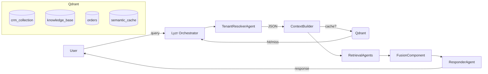

# multi-agentic-customer-support-lyzr-qdrant
This repository demonstrates how to build a context-rich, multiagent AI customer support platform using **Lyzr** for orchestration and **Qdrant** as the vector database. Agents perform specialized tasks—tenant resolution, information extraction, semantic retrieval, routing, and response generation—while sharing context and caching semantics for low-latency, high-throughput operations.

---

## Features

- **Modular Agents**: Each `Agent` handles a specific responsibility (e.g., `TenantResolver`, `OrderIDExtractor`, `Responder`).
- **Hybrid Retrieval**: Combines dense (semantic) and sparse (lexical) embeddings for precision.
- **Metadata Filtering**: Payload-based filtering (e.g., `tenant_id`, `source_type`, `tags`).
- **Semantic Caching**: Low-threshold semantic cache to avoid repeated vector searches.
- **GPU Acceleration (Optional)**: Configure Qdrant with GPU support for high-concurrency.
- **Multimodal**: Support for text and image embeddings.

---

## Architecture



- **Lyzr** manages agent lifecycle, routing, and pipelines.
- **Qdrant** handles vector storage, hybrid search, and semantic caching.

---

## Prerequisites

- **Python 3.10+**
- **Docker** (for Qdrant)
- **API Keys**
  - Gemini / Google Generative AI key (stored in `.env`)

---

## Installation

Clone the repository:

```bash
https://github.com/quamernasim/multi-agentic-customer-support-lyzr-qdrant.git
cd multi-agentic-customer-support-lyzr-qdrant
```

We are using UV Package manager. 

```bash
curl -Ls https://astral.sh/uv/install.sh | bash
```

Install Python dependencies:

```bash
uv lock
uv sync
```

---

## Configuration

Create a `.env` file at the project root:

   ```dotenv
   GEMINI_API_KEY=<your_api_key>
   ```

---

## Setup Qdrant

1. Launch Qdrant in Docker:

```bash
docker run --gpus=all -p 6333:6333 -p 6334:6334 -e QDRANT__GPU__INDEXING=1 -v $(pwd)/qdrant_storage:/qdrant/storage:z qdrant/qdrant:gpu-nvidia-latest
```

2. Initialize collections:

```bash
uv run src/qdrant_util/setup_qdrant.py
```

- Creates hybrid/vector collections
- Configures dense, sparse, and optional image indices

---

## Data Ingestion

Populate Qdrant with your knowledge base, CRM data, FAQs, orders, etc.:

```bash
uv run src/qdrant_util/ingest_data.py
```

- handles batched embedding & upsert using `fastembed` and `qdrant-client`.

---

## Running the Chat Orchestrator

Start an interactive session with multiagent support:

```bash
uv run src/run_chat.py
```

**Workflow per query:**

1. **Tenant Resolution**: Determines tenant type (e.g., `ecom`, `fintech`).
2. **Semantic Cache Check**: Returns cached response if query similarity < threshold.
3. **Pipeline Execution**:
   - Extraction tasks (OrderID, Ticket, etc.)
   - Retrieval tasks (CRM, FAQs, policies)
   - Fusion & routing
   - Response generation via `ResponderAgent`
4. **Cache Storage**: Saves new query–response pair for future hits.

Type `exit` to terminate the session.

---

## Code Structure

```
.
├── LICENSE
├── README.md
├── data
│   ├── ecom
│   │   ├── crm_records.csv
│   │   ├── helpdesk_logs.csv
│   │   ├── images
│   │   │   ├── ORD-0001.jpg
│   │   │   ├── ORD-0002.jpg
│   │   │   ├── ORD-0003.jpg
│   │   │   ├── ORD-0004.jpg
|   |   |   ├── ...
│   │   ├── knowledge_base
│   │   │   ├── faqs.json
│   │   │   ├── handbook.json
│   │   │   └── policy.json
│   │   └── orders.csv
│   └── fintech
│       ├── crm_records.csv
│       ├── helpdesk_logs.csv
│       └── knowledge_base
│           ├── faqs.json
│           ├── handbook.json
│           └── policy.json
├── notebooks
│   ├── fix_bugs.ipynb
│   ├── imge_embedding.ipynb
│   ├── qdrant_ingestion.ipynb
│   ├── qdrant_retrieval.ipynb
│   └── scrape_amazon.ipynb
├── pyproject.toml
├── src
│   ├── agents_util
│   │   ├── agents.py
│   │   └── tasks.py
│   ├── llm.py
│   ├── qdrant_util
│   │   ├── caching.py
│   │   ├── ingest_data.py
│   │   ├── qdrant_retriever.py
│   │   └── setup_qdrant.py
│   ├── run_chat.py
│   └── utils.py
└── uv.lock
```

---

## Key Modules

### `src/agents_util/agents.py`

- Defines `Agent` instances with JSON-only output personas.
- e.g., `TenantResolverAgent`, `OrderIDExtractorAgent`, `ResponderAgent`.

### `src/agents_util/tasks.py`

- Wraps agents and the Gemini model into `Task` objects.
- Provides factory functions: `get_tenant_identification_task()`, etc.

### `src/qdrant_util/qdrant_retriever.py`

- Implements `retrieve_context()`:
  - Builds dense + sparse prefetch queries
  - Applies payload filters (`tenant_id`, `tags`, etc.)
  - Uses RRF fusion to merge results

### `src/qdrant_util/caching.py`

- `SemanticCache`: stores query embeddings & responses.
- Uses a low similarity threshold to avoid redundant searches.

### `src/run_chat.py`

- Main CLI loop for interactive sessions.
- Demonstrates full pipeline: resolution → cache → retrieval → fusion → response → caching.

---

## Enhancements & Extensions

- **Advanced Fusion**: Support additional ranking methods (e.g., CombSUM, neural rerankers).
- **Distributed Agents**: Deploy each agent as a microservice and orchestrate via gRPC or REST.
- **UI Integration**: Connect to a web front-end (React/Vue) for user-friendly chat.

---

## License

This project is licensed under the MIT License. See [LICENSE](LICENSE) for details.

---

## Contact

For questions or contributions, please open an issue or reach out to [[quamer23nasim38@gmail.com](mailto\:quamer23nasim38@gmail.com)]. Happy building!

